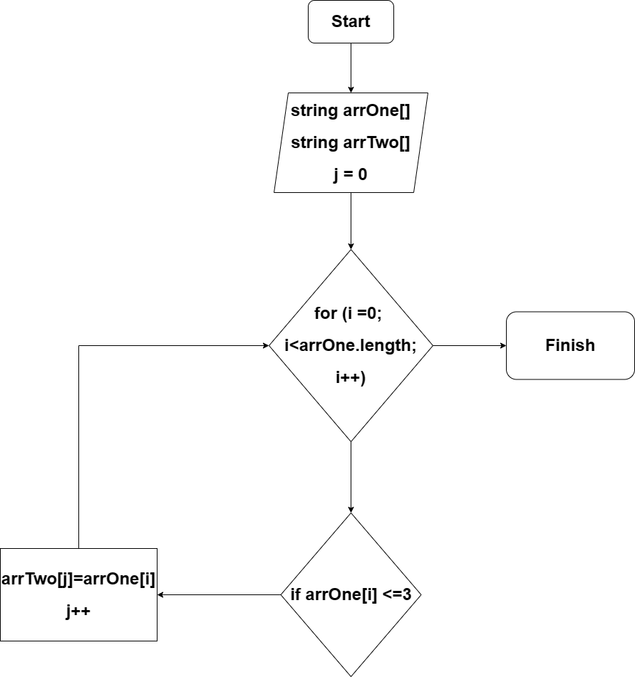

# **FinalWorkFirstblock** Репозиторий для итоговой работы по первому блоку факультета "Разработчик"
## **Задание:**
## 1.  _Создание репозитория на GitHub_
## 2.  _Нарисовать блок-схему алгоритма_

## 3.  _Снабдить репозиторий оформленным текстовым описанием решения_
## 4.  _Написать программу, решающую поставленную задачу_
## 5.  _Использовать контроль версий, оформить отдельными коммитами этапы 2, 3, 4_
## **Задача:**
> ##  Написать программу, которая из имеющегося строк формирует массив из строк, длина которых меньше либо равна 3 символам. Первоначальный массив можно ввести с клавиатуры, либо задать на старте выполнения алгоритма. При решении не рекомендуется пользоваться коллекциями, лучше обойтись исключительно массивами.

## **Примеры:**
## ["hello","2","world",":-)"]->["2",":-)"] ["1234","1567","-2","computer_science"]->["-2"] ["Russia","Denmark","Kazan"]->[]